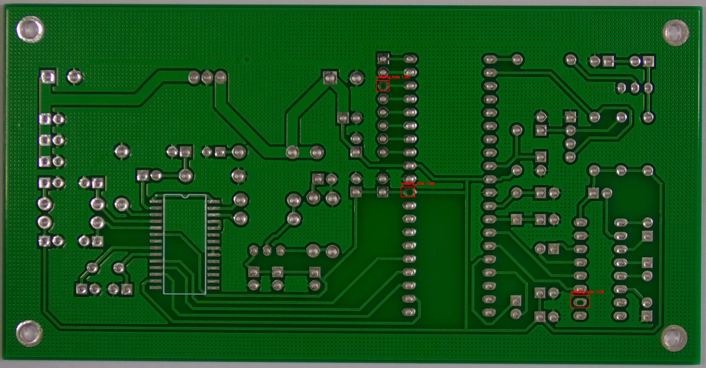

# PCB Defect Detection AI

A beautiful, professional web-based application that leverages artificial intelligence to detect defects in Printed Circuit Boards (PCBs). The application allows users to upload images or capture them in real-time via their webcam or external camera, analyzes them using a custom Roboflow model, and highlights missing holes, shorts, or other defects with extreme precision.

## Example Output

## Features

- **AI-Powered Analysis**: Instantly detects and highlights PCB defects using a computer vision model powered by the Roboflow Inference API.
- **Dual Input Modes**: 
  - **Upload Image**: Drag and drop or browse to upload existing PCB images (JPG/PNG).
  - **Live Camera Capture**: Real-time camera integration with intelligent device enumeration (automatically detects built-in Webcams vs. External Cameras).
- **Professional UI**: 
  - Glassmorphism design system for a premium feel.
  - Built-in **Light and Dark themes** with a seamless toggle switch and automatic user preference saving.
  - Fully responsive and sleek layout.
- **Local Scan History**: Automatically saves your 12 most recent scans locally in your browser so you can review previous results, complete with compressed thumbnails and defect counts.
- **Zero Backend Required**: Entirely client-side logic using standard web technologies (HTML, CSS, JS).

## Usage

Since this is a fully static client-side application, getting started is extremely easy:

1. Clone the repository or simply download the `index.html` file.
2. Open `index.html` in any modern web browser.
3. Select the **Upload Image** or **Use Camera** tab.
4. Provide a PCB image, and the AI will instantly draw bounding boxes around any detected defects!

## Note on API Key
The application currently runs entirely in the browser and connects directly to the Roboflow API. For production use or widespread deployment, it is recommended to proxy these requests through a backend server to hide your API Key.

## Technologies Used
- HTML5, CSS3, Vanilla JavaScript
- Roboflow Inference API
